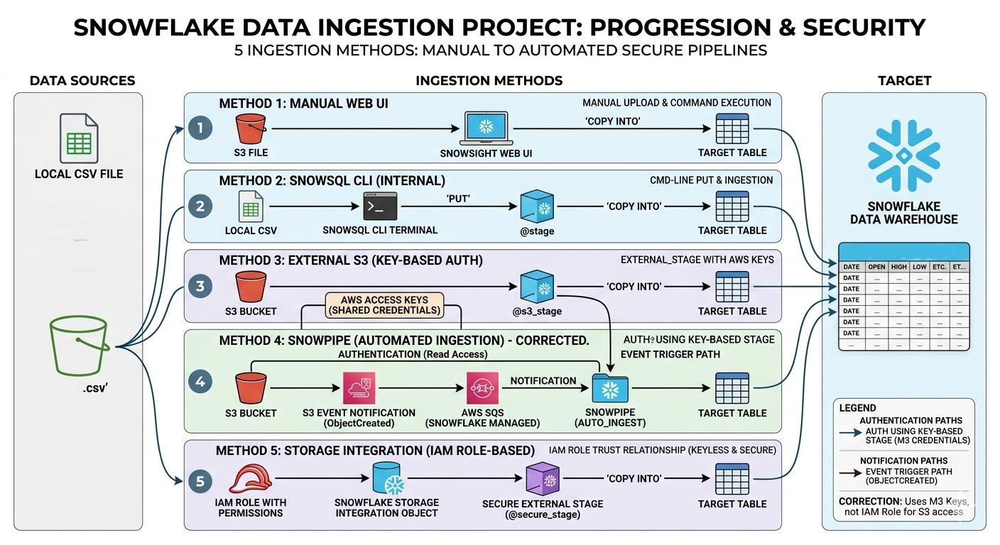

# ❄️ Snowflake Data Ingestion: From Manual to Automated Pipelines

This project demonstrates five distinct methods of ingesting data into **Snowflake**, covering everything from local file uploads to automated, secure cloud-native pipelines. The project utilizes **AWS S3** as the primary data source and **SnowSQL** for command-line orchestration.

## 📑 Table of Contents
1. **Method 1**: Manual Ingestion via Snowsight (Web UI)
2. **Method 2**: Command Line Ingestion via SnowSQL
3. **Method 3**: External Staging (AWS S3 Integration)
4. **Method 4**: Continuous Ingestion via Snowpipe (Automation)
5. **Method 5**: Secure Ingestion via Storage Integration (Best Practice)

---

## 🛠️ Tech Stack
*   **Data Warehouse**: Snowflake
*   **Cloud Provider**: AWS (S3, IAM)
*   **CLI Tool**: SnowSQL
*   **Languages**: SQL, Bash

---

## 🚀 Project Evolution

### 🔹 Method 1: Web UI (Snowsight)
The most basic approach using the Snowflake GUI. 
*   **Best for**: Small, one-time data loads and quick testing.
*   **Key Action**: Uploaded CSV directly through the browser.

### 🔹 Method 2: SnowSQL CLI
Transitioned to the command line for better control and scriptability.
*   **Key Action**: Used the `PUT` command to move local files to a Snowflake **Internal Stage** before executing `COPY INTO`.

### 🔹 Method 3: External Staging (S3)
Moved the data source to the cloud using **AWS S3**.
*   **Key Action**: Configured an **External Stage** to pull data directly from an S3 bucket using AWS Access Keys.

### 🔹 Method 4: Snowpipe (Automation)
Implemented a serverless, continuous ingestion pipeline.
*   **Key Action**: Set up **S3 Event Notifications** and **SQS Queues** to trigger **Snowpipe** automatically whenever a new file is uploaded to the cloud.

### 🔹 Method 5: Storage Integration (Security Focus)
Enhanced security by removing hardcoded credentials.
*   **Key Action**: Created a **Storage Integration Object** to establish a secure, keyless handshake between Snowflake and AWS via **IAM Roles**.

---

## 📈 Key Learnings
*   **Automation**: Reduced manual effort by 100% through Snowpipe.
*   **Security**: Implemented IAM-based trust relationships to protect cloud credentials.
*   **Scalability**: Built a foundation capable of handling massive datasets in a cloud-native environment.

---

## 📂 Repository Structure
*   `/scripts`: SQL scripts for each method.
*   `/data`: Sample CSV files (Tesla Stock Data, Customer Details).
*   `/Methods_of_Implementation`: Detailed breakdown of each ingestion method.
*   `/Method_05_Policies`: Inline & Trust Relationship policy for IAM Role (for Method 5)

---

**Muhammad Osama Hashmi**  
*Chemical Engineer & Cloud Data Engineering Student*  
[GitHub: clouddatawithosama](https://github.com/clouddatawithosama)

---